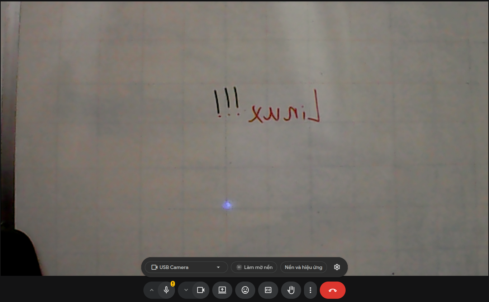
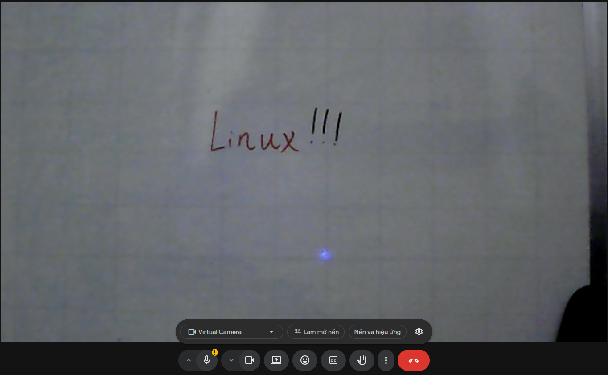

# 📸 Linux Virtual Camera


A blazingly fast, dependency-light middleware process that sits between your physical hardware camera and end-user applications. It captures, processes, and pushes real-time video to a virtual kernel device, ensuring your filters work system-wide across Zoom, Google Meet, OBS, and web browsers.

---

## 📸 Demo visual

| Original Feed | Processed Output |
| :---: | :---: |
|  |  |
| *Standard Camera* | *Virtual Camera with `--mirror`* |

---

## 🎭 The Problem: Before vs. After

Most built-in Linux camera drivers do not offer a native way to horizontally mirror your image or apply global color filters. This creates a disorienting experience where raising your right hand looks like your left hand on screen.

| ❌ Before (Standard Linux Webcam) | ✨ After (Virtual Camera Pipeline) |
| :--- | :--- |
| **Disorienting:** Movements are inverted compared to a real mirror. | **Natural:** Perfect horizontal mirroring for intuitive movement. |
| **Boring:** Stuck with standard hardware colors. | **Customizable:** Stack Sepia, Grayscale, and more. |
| **App-Dependent:** You have to configure filters in every single app. | **System-Wide:** Configure it once; it works in *all* apps automatically. |
| **Bloated:** Usually requires running heavy UI apps like OBS Studio. | **Lightweight:** Runs silently in the terminal with millisecond latency. |

---

## ⚙️ How It Works

This project uses ultra-fast, header-only `stb` C/C++ libraries. The pipeline operates in three simple stages:

1. 📥 **Read:** Automatically negotiates the absolute highest supported resolution and framerate from your physical camera (MJPEG or YUYV) via the native V4L2 API.
2. 🧠 **Process:** Decodes the frame directly in memory, applies pixel-level mathematical transformations, and re-encodes it.
3. 📤 **Write:** Pushes the processed frame directly into the OS kernel, spoofing a real hardware camera.

---

## 🛠️ Prerequisites

You only need a few basic tools installed on your Ubuntu/Linux system.

* `v4l2loopback-dkms`: The kernel module that creates the virtual device.
* `build-essential` & `wget`: To compile the C++ code and fetch dependencies.

> **Note:** The necessary image processing libraries (`stb_image.h` and `stb_image_write.h`) are automatically downloaded into `image/deps/` the first time you compile the project.

---

## 🚀 Build & Run

To set up the virtual hardware and compile the pipeline, run these commands in your terminal:

```bash
# 1. Clear any existing virtual cameras to prevent conflicts
sudo rmmod v4l2loopback 

# 2. Create the virtual device (maps permanently to /dev/video2)
sudo modprobe v4l2loopback exclusive_caps=1 keep_format=1 video_nr=2 card_label="Virtual Camera"

# 3. Build the highly-optimized C++ binary
make
```

*(Development Tip: Run `make dev` instead to compile with strict `-Wall -Wextra` warnings enabled).*

---

## 🎮 Usage

When you launch the executable, it will automatically probe your hardware, print the optimized configuration, and start streaming. It even displays a live-updating pipeline latency tracker!

### Standard Pass-through
```bash
./main
```

### Apply Filters (Stackable)
You can stack multiple effects by passing command-line flags. The pipeline processes them in the exact order you provide:

```bash
# Natural mirror mode
./main --mirror

# Vintage black and white
./main --gray

# Stacked: Mirrored and Sepia tone
./main --mirror --sepia
```
